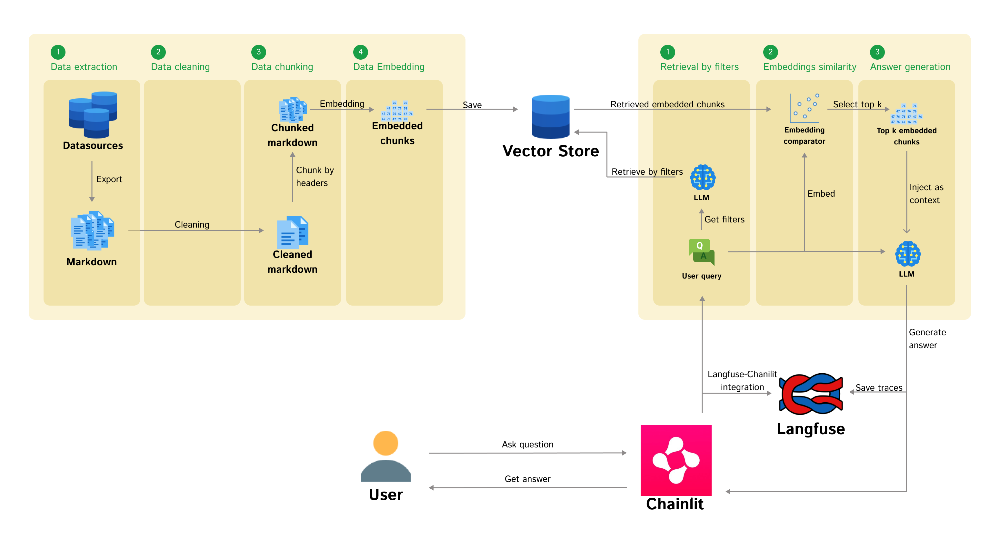
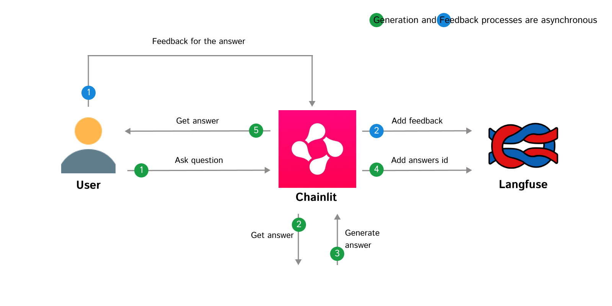

# RAG Blueprint

A comprehensive open-source framework for building production-ready Retrieval-Augmented Generation (RAG) systems. This blueprint simplifies the development of RAG applications while providing full control over performance, resource usage, and evaluation capabilities.

While building or buying RAG systems has become increasingly accessible, deploying them as production-ready data products remains challenging. Our framework bridges this gap by providing a streamlined development experience with easy configuration and customization options, while maintaining complete oversight of performance and resource usage.

It comes with built-in monitoring and observability tools for better troubleshooting, integrated LLM-based metrics for evaluation, and human feedback collection capabilities. Whether you're building a lightweight knowledge base or an enterprise-grade application, this blueprint offers the flexibility and scalability needed for production deployments.

<div align="center">
  
</div>

## 🚀 Features

- **Multiple Knowledge Base Integration**: Seamless extraction from several Data Sources(Confluence, Notion, PDF)
- **Wide Models Support**: Availability of numerous embedding and language models
- **Vector Search**: Efficient similarity search using vector stores
- **Interactive Chat**: User-friendly interface for querying knowledge on [Chainlit](https://chainlit.io/)
- **Performance Monitoring**: Query and response tracking with [Langfuse](https://langfuse.com/)
- **Evaluation**: Comprehensive evaluation metrics using [RAGAS](https://docs.ragas.io/en/stable/)
- **Setup flexibility**: Easy and flexible setup process of the pipeline

## 🛠️ Tech Stack

### Core
[Python](https://www.python.org/) • [LlamaIndex](https://www.llamaindex.ai/) • [Chainlit](https://chainlit.io/) • [Langfuse](https://langfuse.com/) • [RAGAS](https://docs.ragas.io/)

---

### Data Sources
[Notion](https://developers.notion.com/) • [Confluence](https://developer.atlassian.com/cloud/confluence/rest/v2/intro/#about) • PDF files

---

### Embedding Models
[VoyageAI](https://www.voyageai.com/) • [OpenAI](https://openai.com/) • [Hugging Face](https://huggingface.co/)

---

### Language Models
[OpenAI](https://openai.com/) • Any [OpenAI](https://openai.com/)-compatible API models

---

### Vector Stores
[Qdrant](https://qdrant.tech/) • [Chroma](https://www.trychroma.com/)

---

### Infrastructure
[PostgreSQL](https://www.postgresql.org/) • [Docker](https://www.docker.com/)


## 🚀 Quickstart

Check the detailed [Quickstart Setup](https://feld-m.github.io/rag_blueprint/quickstart/quickstart_setup/)

## 🏗️ Architecture

### Data Flow

1. **Extraction**:
   - Fetches content from the data sources pages through their respective APIs
   - Handles rate limiting and retries
   - Extracts metadata (title, creation time, URLs, etc.)

2. **Processing**:
   - Markdown-aware chunking using LlamaIndex's MarkdownNodeParser
   - Embedding generation using the selected embedding model
   - Vector storage in Qdrant

3. **Retrieval & Generation**:
   - Context-aware retrieval with configurable filters
   - LLM-powered response generation
   - Human feedback collection

### Evaluation

<div align="center">
  
</div>

The system includes comprehensive evaluation capabilities:

- **Automated Metrics** (via RAGAS):
  - Faithfulness • Answer Relevancy • Context Precision • Context Recall • Harmfulness

- **Human Feedback**:
  - Integrated feedback collection through Chainlit
  - Automatic dataset creation from positive feedback
  - Manual expert feedback support

- **Observability**:
  - Full tracing and monitoring with Langfuse
  - Separate traces for chat completion and deployment evaluation
  - Integration between Chainlit and Langfuse for comprehensive tracking

## 📁 Project Structure

```
.
├── build/            # Build and deployment scripts
│   └── workstation/  # Build scripts for workstation setup
├── configurations/   # Configuration and secrets files
├── res/              # Assets
└── src/              # Source code
    ├── augmentation/   # Retrieval and UI components
    ├── common/         # Shared utilities
    ├── embedding/      # Data extraction and embedding
    └── evaluate/       # Evaluation system
├── tests/            # Unit tests
```

## 📚 Documentation

For detailed documentation on setup, configuration, and development:
- [Documentation Site](https://feld-m.github.io/rag_blueprint/)
- [Quickstart Setup](https://feld-m.github.io/rag_blueprint/quickstart/quickstart_setup/)
